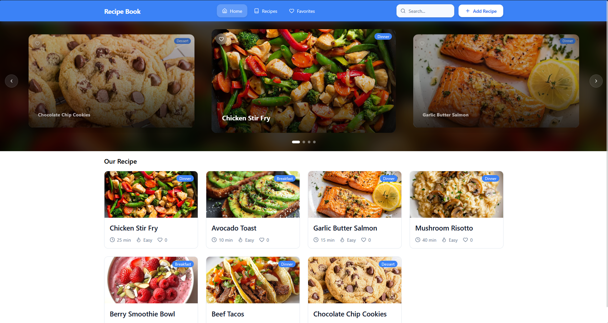

# Project - Interactive Recipe Book

## Course INF-651 (Frontend Web Development)

## Instructor: Singhtararaksmey (Joe) Chea

## Introduction

**An interactive web application that lets users maintain and arrange their recipes in addition to looking through their collection.**



## Preview

View live demo: [site](https://interactive-recipe-book-ts.vercel.app/)

## Features

- Popular Recipes section on the Home page
- Browse recipes by category ( Breakfast, Lunch, Dinner, Desser, Vegetarian, Quick < 30m,etc.)
- Search recipes
- Add/Remove favorite recipes with dedicated Favorite page
- Recipe detail page with full ingredients & instructions
- Share recipe links (copy to clipboard)
- Add new recipes
- Edit recipes
- Fully client-side persistence

## Tech Stack

- **UI and building tooling** - React + Vite
- **client-side routing** - React Router
- **styling** - Tailwind CSS + tranditional css
- **icons** - lucide-react
- **base UI components** - shadcn/ui
- **localStorage** - persists recipes, favorites, and filters
- **IndexedDB** - persists uploaded recipe images (`imageDB.js`)

## Project Structure

```
Interactive-Recipe-Book/
├── public/                        # Static assets (carousel background and SVG icons)
├── src/
│   ├── assets/                    # Seed recipe images
│   ├── components/                # Reusable UI components (Navbar, RecipeCard, RecipeImage...)
│   ├── contexts/                  # React Contexts for application state management
│   |   ├── AddRecipeContext.jsx
│   │   ├── FavoritesContext.jsx
│   │   └── FilterContext.jsx
│   ├── data/                      # Pre-made recipe data for seeding
│   │   └── seedData.js            
│   ├── lib/                       # Helper functions
│   ├── pages/                     # Routed page views (Home, RecipeLibrary, Favorites,...)
│   ├── styles/                    # Global styles and CSS custom properties (color variables)
│   ├── App.jsx                    # Main routing configuration and Context providers
│   └── main.jsx                   # Application entry point
├── index.html
├── package.json
├── tailwind.config.js
├── vite.config.js
└── README.md
```

## Getting Started:
1. Clone the repository:

   ```
   git clone https://github.com/SrunTechsean/Interactive-Recipe-Book.git
   cd Interactive-Recipe-Book
   ```

2. Install dependencies:

   ```
   npm install
   ```

3. Start the dev server:

   ```
   npm run dev
   ```
